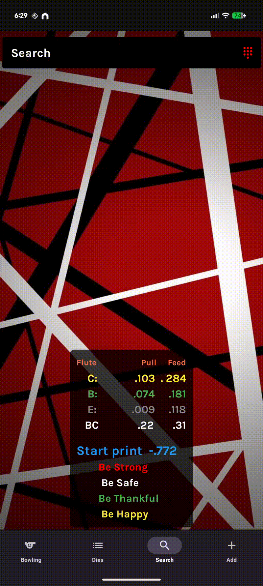
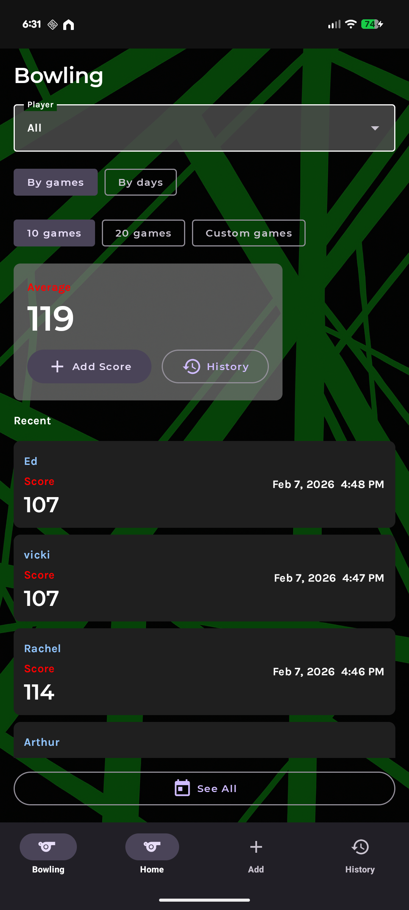

# WestRock Rotary Die Cutter App

An Android application developed in Kotlin using Jetpack Compose for UI and SQLite for data persistence. This app allows users to interact with rotary die cutter data through features like add, search, edit, and view details.

```

## ⚙️ Features

- 🧭 **Navigation**: Modular navigation using `AppNav.kt` and `BottomNav.kt`.
- 🔍 **Search**: Search for records using multiple criteria in `search.kt`.
- ➕ **Add**: Add new entries with a dedicated screen.
- 📝 **Detail/Edit**: View and modify details of an existing item.
- 🗃️ **Database Integration**: SQLite integration via `sql_database.kt`.
- 🎨 **Jetpack Compose UI**: All screens implemented using modern Compose components.

## 🚀 Getting Started

### Prerequisites

- Android Studio (Flamingo or newer)
- Kotlin 1.8+
- Gradle 8+

### Installation

1. Clone the repository:
   ```bash
   git clone https://github.com/inferi70/WestRock-App.git
   cd WestRock-App
   ```

2. Open in Android Studio:
   - `File -> Open -> Select root directory of the project`

3. Build the project and run on an emulator or connected device.

## 🛠 Tech Stack

- **Language**: Kotlin
- **UI**: Jetpack Compose
- **Database**: SQLite (via `sql_database.kt`)
- **Architecture**: MVVM-lite (using state models like `RotaryView`)

## 📷 Screenshots
### Search (Home) Page
<p align="center">
  
</p>

### Dies Page
<p align="center">
  
</p>

### Add/Load Page
<p align="center">
  
</p>

### Bowling Page
<p align="center">
  
</p>

## 📄 License

This project is licensed under the MIT License - see the [LICENSE](LICENSE) file for details.
